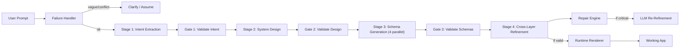

# NL-to-App Compiler: Implementation Plan

> A system that compiles natural language → structured config → validated → executable → working application

## Architecture Overview



## Technology Stack

| Layer | Technology | Rationale |
|-------|-----------|-----------| 
| **Backend** | Node.js + Express | Fast async I/O, native JSON handling |
| **Frontend** | Vanilla HTML/CSS/JS | No framework overhead, premium glassmorphism UI |
| **LLM** | Google Gemini API (`gemini-3.1-flash-lite`) | 15 RPM / 500 RPD free tier, good structured output |
| **Validation** | Custom validators + repair engine | Purpose-built for cross-layer schema consistency |
| **Runtime** | Dynamic HTML/CSS/JS renderer | Generates standalone apps from config |
| **Storage** | localStorage (in generated apps) | No external DB needed; apps are self-contained |

> [!NOTE]
> The system uses `gemini-3.1-flash-lite` by default for high throughput (15 RPM, 500 RPD). Can be switched to `gemini-3.5-flash` or `gemini-2.5-flash` for higher quality at lower throughput.

---

## Implemented Changes

### Phase 1: Project Scaffolding & Design System ✅

#### [package.json](file:///e:/intern/package.json)
- Dependencies: `express`, `dotenv`, `cors`
- Scripts: `dev` (nodemon), `start`, `evaluate`

#### [frontend/index.html](file:///e:/intern/frontend/index.html)
- Premium dark-mode UI with split-pane layout
- Pipeline progress visualization (4 stages with animated states)
- Output tabs: Live Preview, UI Schema, API Schema, DB Schema, Auth Rules, Full Config
- Example prompt chips, history modal, evaluation modal

#### [frontend/index.css](file:///e:/intern/frontend/index.css)
- Complete design system: 1290+ lines, CSS custom properties
- Dark mode with glassmorphism cards, animated backgrounds
- Responsive layout with Inter + JetBrains Mono fonts
- Micro-animations: pulse, float, glow drift, slide-in

#### [frontend/app.js](file:///e:/intern/frontend/app.js)
- Compile flow: prompt → /api/generate → display results
- Modify flow: existing config + modification → /api/modify
- Tab system, schema syntax highlighting, clipboard copy
- History (localStorage), session reset, evaluation runner

---

### Phase 2: Multi-Stage Generation Pipeline ✅

#### [server/index.js](file:///e:/intern/server/index.js)
- Express server with 3 API endpoints: `/api/generate`, `/api/modify`, `/api/evaluate`
- Health check endpoint, static file serving, SPA fallback

#### [server/pipeline/index.js](file:///e:/intern/server/pipeline/index.js)
- **Compiler-style orchestrator** with 4 stages + 3 inter-stage validation gates
- Stage-tagged errors (`err.stage = 'intent' | 'design' | 'schema' | 'refine'`)
- Modify mode: augments prompt with existing config summary
- Exposes intermediate results (`intent`, `design`) for inspection
- Collects per-stage timing metrics

#### [server/pipeline/stage1-intent.js](file:///e:/intern/server/pipeline/stage1-intent.js)
- Parses user prompt → structured intent (entities, features, roles, rules)
- Output validated by Gate 1 before passing to Stage 2

#### [server/pipeline/stage2-design.js](file:///e:/intern/server/pipeline/stage2-design.js)
- Intent → app architecture (pages, navigation, relationships, flows)
- Output validated by Gate 2 before passing to Stage 3

#### [server/pipeline/stage3-schema.js](file:///e:/intern/server/pipeline/stage3-schema.js)
- Generates 4 schemas in **parallel** (UI, API, DB, Auth)
- Each sub-schema is a separate LLM call for precision
- Output validated by Gate 3 before passing to Stage 4

#### [server/pipeline/stage4-refine.js](file:///e:/intern/server/pipeline/stage4-refine.js)
- Cross-layer consistency check via [consistency.js](file:///e:/intern/server/validation/consistency.js)
- Auto-repair via [repair.js](file:///e:/intern/server/validation/repair.js)
- LLM refinement **only for critical errors** (not warnings/info)
- Sends compact summary instead of full config to avoid timeouts

---

### Phase 3: Validation + Repair Engine ✅

#### [server/validation/validator.js](file:///e:/intern/server/validation/validator.js)
- `validateIntent()` / `repairIntent()` — Gate 1 validation
- `validateDesign()` / `repairDesign()` — Gate 2 validation
- Ensures required fields, entity `id`/timestamps, User entity when roles exist
- Auto-generates navigation from pages, injects login/register/dashboard

#### [server/validation/consistency.js](file:///e:/intern/server/validation/consistency.js)
- 6 cross-layer consistency checks:
  - API entity → DB table exists
  - API auth roles → Auth roles defined
  - UI requiredRole → Auth roles defined
  - UI component entity → DB table exists
  - DB foreign key → referenced table exists
  - Auth route guard roles → defined roles

#### [server/validation/repair.js](file:///e:/intern/server/validation/repair.js)
- Auto-repair strategies (targeted, not brute-force):
  - Missing `id` column → inject UUID primary key
  - Missing timestamps → inject `created_at` / `updated_at`
  - FK references non-existent table → remove reference
  - Entity without DB table → auto-create table
  - Undefined role → add to `auth.roles`
  - Duplicate paths → deduplicate

---

### Phase 4: LLM Integration ✅

#### [server/llm/client.js](file:///e:/intern/server/llm/client.js)
- `callGemini()` — main LLM call function with:
  - JSON mode enforcement (`responseMimeType: 'application/json'`)
  - `extractJSON()` fallback parser (bracket matching, code fence stripping)
  - Exponential backoff with rate-limit-aware delays (15s for quota, 2s for others)
  - Token tracking (`tokenTracker`) for cost estimation
  - Configurable model, temperature, maxRetries
  - 120s timeout, 65536 maxOutputTokens

#### [server/llm/prompts.js](file:///e:/intern/server/llm/prompts.js)
- 7 structured prompts: Intent, Design, UI Schema, API Schema, DB Schema, Auth Schema, Refinement
- Each prompt specifies exact JSON structure with field names, types, constraints
- Constrained value sets (e.g., `type must be one of: string, number, boolean, date...`)

---

### Phase 5: Runtime / Execution Engine ✅

#### [server/runtime/renderer.js](file:///e:/intern/server/runtime/renderer.js)
- Takes validated config → generates complete standalone HTML app
- Assembles: CSS (from templates) + component HTML + JS (routing, auth, CRUD)

#### [server/runtime/components.js](file:///e:/intern/server/runtime/components.js)
- 16+ component types: StatCard, DataTable, Form, Chart, LoginForm, RegisterForm, KanbanBoard, CalendarView, Timeline, DetailView, SearchFilter
- `mapFieldType()` — enforces type safety in form inputs
- `generateSampleData()` — creates realistic sample data per entity

#### [server/runtime/templates.js](file:///e:/intern/server/runtime/templates.js)
- Full app shell with sidebar navigation, auth system, CRUD operations
- Client-side hash-based routing, role switching, permission enforcement
- Toast notifications, modal forms, responsive design
- No external dependencies except Google Fonts

---

### Phase 6: Failure Handling ✅

#### [server/pipeline/failure-handler.js](file:///e:/intern/server/pipeline/failure-handler.js)
- Too short (<5 chars) → clarification questions
- Non-app ("write me a poem") → regex detection, graceful handling
- Vague (<30 chars) → LLM analysis, makes assumptions
- Conflicting requirements → `containsConflicts()` heuristic + LLM detection
- Design principle: **prefer assumptions over questions**

---

### Phase 7: Evaluation Framework ✅

#### [evaluation/prompts.json](file:///e:/intern/evaluation/prompts.json)
- 10 real product prompts (CRM, E-commerce, LMS, HR, Healthcare, etc.)
- 10 edge cases (vague, conflicting, single word, non-app, etc.)

#### [evaluation/runner.js](file:///e:/intern/evaluation/runner.js)
- Automated test runner, streams results via NDJSON
- Tracks: success/fail, duration, repair count, failure type

#### [evaluation/metrics.js](file:///e:/intern/evaluation/metrics.js)
- Aggregates: success rate, latency (avg/min/max/P95), token usage, cost, failure types
- Category breakdown (real prompts vs edge cases)

---

## File Structure

```
e:/intern/
├── package.json              # Dependencies + scripts
├── .env                      # GEMINI_API_KEY (gitignored)
├── .env.example              # Template
├── objective.txt             # Task specification
├── README.md                 # Architecture documentation
├── implementation_plan.md    # This file
├── walkthrough.md            # Requirements compliance walkthrough
│
├── frontend/
│   ├── index.html            # Premium dark-mode compiler UI
│   ├── index.css             # Design system (1290+ lines)
│   └── app.js                # Frontend logic + modify mode
│
├── server/
│   ├── index.js              # Express server (3 endpoints)
│   ├── pipeline/
│   │   ├── index.js          # Orchestrator (4 stages + 3 gates)
│   │   ├── stage1-intent.js  # NL → structured intent
│   │   ├── stage2-design.js  # Intent → app architecture
│   │   ├── stage3-schema.js  # Architecture → 4 schemas (parallel)
│   │   ├── stage4-refine.js  # Cross-layer validation + repair
│   │   └── failure-handler.js# Vague/conflicting handling
│   ├── validation/
│   │   ├── validator.js      # Schema validation + inter-stage gates
│   │   ├── consistency.js    # Cross-layer consistency checker
│   │   └── repair.js         # Auto-repair engine
│   ├── llm/
│   │   ├── client.js         # Gemini API client (retry, tracking)
│   │   └── prompts.js        # 7 structured prompts
│   └── runtime/
│       ├── renderer.js       # Config → standalone HTML app
│       ├── components.js     # 16+ component types
│       └── templates.js      # App shell (CSS + JS + Auth + CRUD)
│
└── evaluation/
    ├── prompts.json          # 20 test prompts
    ├── runner.js             # Automated runner
    └── metrics.js            # Metrics + reporting
```

---

## Verification Plan

### Automated Tests
1. **Pipeline integration**: Run CRM prompt end-to-end, verify all 4 stages complete
2. **Gate validation**: Verify intent/design repair when fields are missing
3. **Consistency checks**: Verify cross-layer reference detection (API→DB, UI→Auth)
4. **Repair engine**: Verify auto-repair for missing `id`, timestamps, orphaned FKs
5. **Evaluation suite**: Run all 20 prompts via `/api/evaluate`

### Manual Verification
1. **Live demo**: Open http://localhost:3000, compile "CRM with contacts, deals, dashboard"
2. **Edge cases**: Enter vague/conflicting prompts, verify graceful handling
3. **Mid-way modification**: Generate app → modify requirements → verify adaptation
4. **Preview validation**: Verify generated app has working auth, CRUD, routing, charts

### Commands
```bash
npm install          # Install dependencies
cp .env.example .env # Configure API key
npm run dev          # Start server (http://localhost:3000)
npm run evaluate     # Run evaluation suite
```

---

## Design Decisions

| Decision | Rationale |
|----------|-----------|
| 4 separate stages (not 1 mega-prompt) | Modular = testable, repairable, inspectable |
| Inter-stage validation gates | Catches errors early, prevents cascading failures |
| Parallel schema generation | 4x faster Stage 3 (enabled by 15 RPM model) |
| JSON mode + extractJSON() fallback | Belt-and-suspenders approach to JSON reliability |
| Skip LLM refinement for non-critical | Saves cost + avoids timeouts on large configs |
| Compact refinement context | Prevents token limit issues with large schemas |
| temperature: 0.1 | Determinism over creativity |
| localStorage in generated apps | Self-contained, no external DB needed |
| Assumptions over questions | Users want results, not interrogation |
| Stage-tagged errors | Precise debugging: "failed at stage: schema" |
